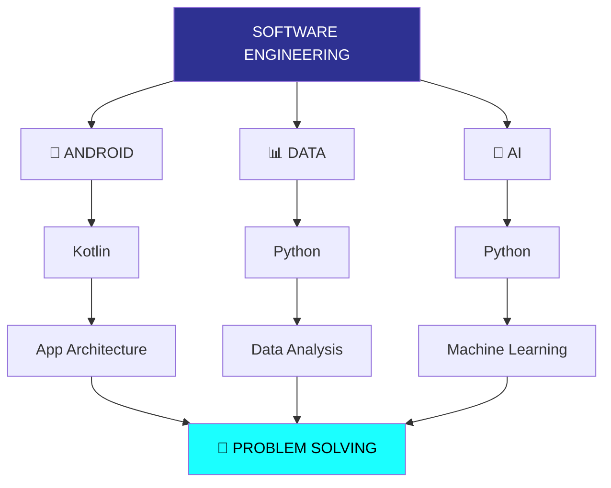

<div align="center">


<br/>

<a href="https://github.com/0xsoheildev">
  
</a>
<a href="https://github.com/0xsoheildev">
  
</a>

</div>

<br/>

## 🧑‍💻 About Me

I'm a Software Engineer focused on building software that's **reliable**, **maintainable**, and genuinely well-engineered — not just software that "works."

```kotlin
class Soheil : SoftwareEngineer {
    val focus = listOf("Android", "Data", "Artificial Intelligence")
    val mindset = "Understand the system before you touch the API"

    override fun currentGoal() =
        "Turn ideas into practical, well-architected software"
}
```

- 📱 **Android Development** — Kotlin, app architecture
- 📊 **Data** — Python, data analysis
- 🤖 **Artificial Intelligence** — Python, machine learning
- 🧠 **Problem Solving & Algorithms**
- 🏗️ **Software Engineering & Architecture**

I enjoy understanding how things work under the hood, solving problems systematically, and turning ideas into practical software.

<br/>

## 🧭 Engineering Focus

<div align="center">



</div>

<br/>

## 🛠️ Technologies & Tools

<div align="center">

**Programming Languages**


**Android Development**


**Data & AI**


**Tools & Environment**


</div>

<br/>

## 🧠 What I Care About

<table width="100%">
<tr>
<td width="50%" valign="top">

### 🧼 Clean Code
Writing code that is easy to read, understand, test, and maintain.

</td>
<td width="50%" valign="top">

### 🧩 Problem Solving
Breaking complex problems into simple, understandable pieces.

</td>
</tr>
<tr>
<td width="50%" valign="top">

### 🏗️ Software Design
Thinking about architecture, abstraction, scalability, and trade-offs.

</td>
<td width="50%" valign="top">

### 📚 Continuous Learning
Understanding fundamentals instead of simply learning tools and frameworks.

</td>
</tr>
</table>

<br/>

## ⚙️ Engineering Principles

<div align="center">

**Understand the problem** → **Design the solution** → **Keep it simple** → **Write maintainable code** → **Test important behavior** → **Measure & improve**

</div>

I believe good software is not just software that works. Good software should also be:

`Reliable` `Maintainable` `Understandable` `Testable` `Adaptable`

<br/>

## 🧩 Problem Solving

I enjoy working on problems involving:

`Data Structures` · `Algorithms` · `Computational Thinking` · `Complexity Analysis` · `Logical Reasoning` · `Software Design`

> My goal is to understand not only **how** a solution works, but also **why** it works and **when** it should be used.

<br/>

## 📚 Learning Philosophy

<div align="center">

**Learn the fundamentals** → **Understand the system** → **Build something real** → **Break it** → **Fix it** → **Improve it**

</div>

I prefer understanding the concepts behind a technology rather than simply learning how to use its APIs.

<br/>

## 📈 GitHub Stats

<div align="center">


</div>

<br/>

## 🌐 Connect

<div align="center">

<a href="https://github.com/0xsoheildev">
  
</a>
<!-- Add LinkedIn / Email / Twitter badges here when ready, e.g.:
<a href="https://linkedin.com/in/your-handle">
  
</a>
-->

</div>

<br/>

<div align="center">

### Build. Learn. Improve. Repeat.


</div>
